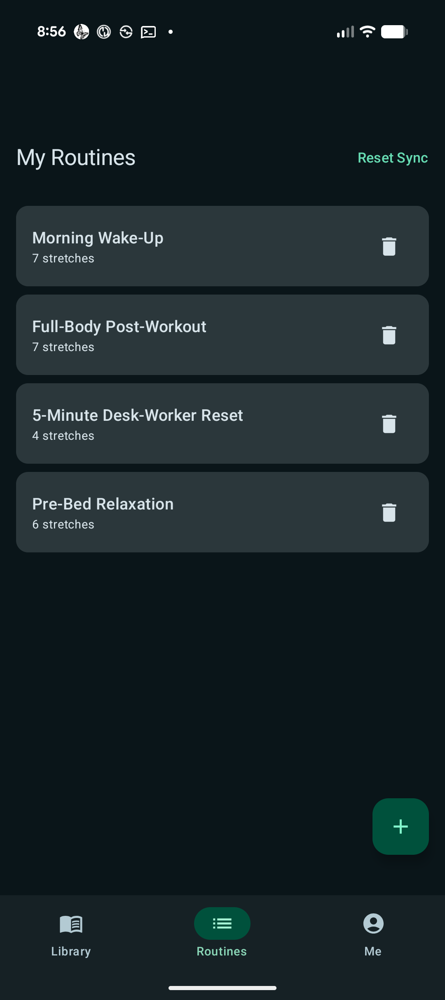
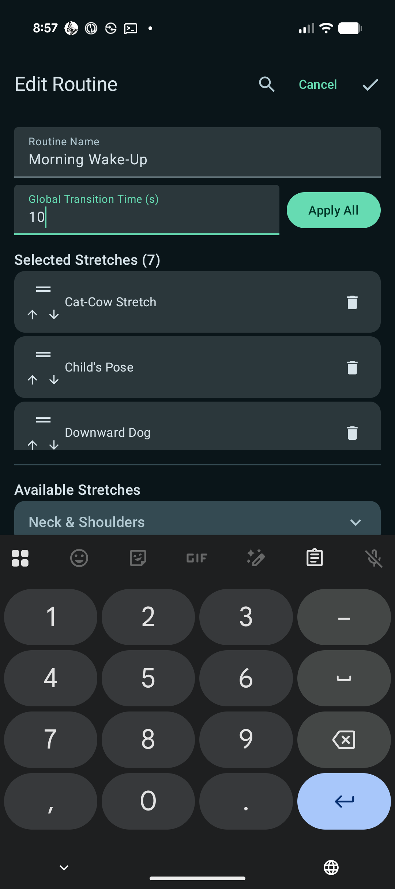
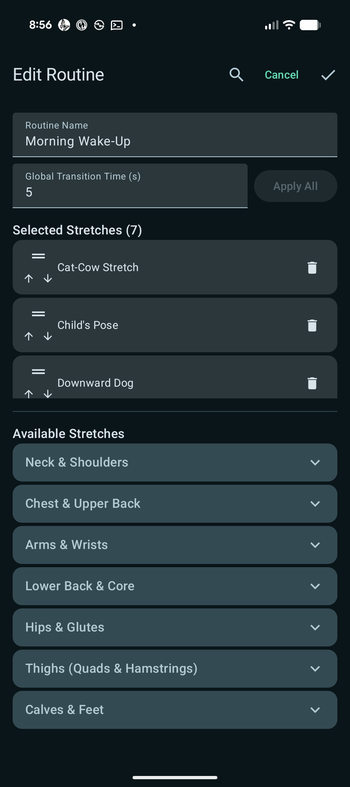
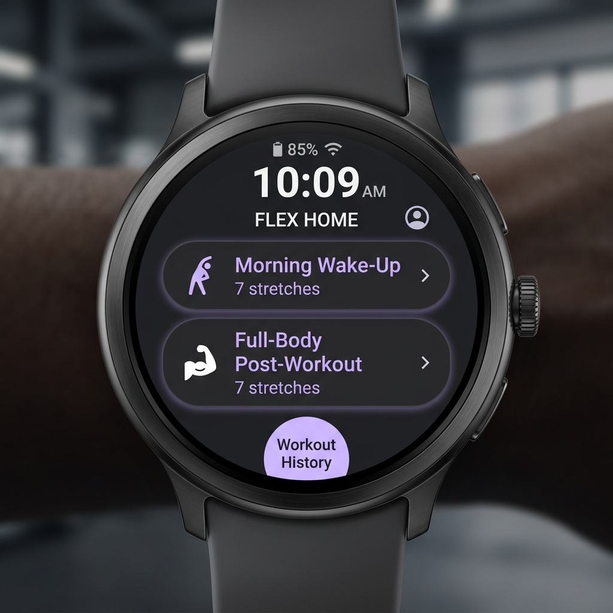
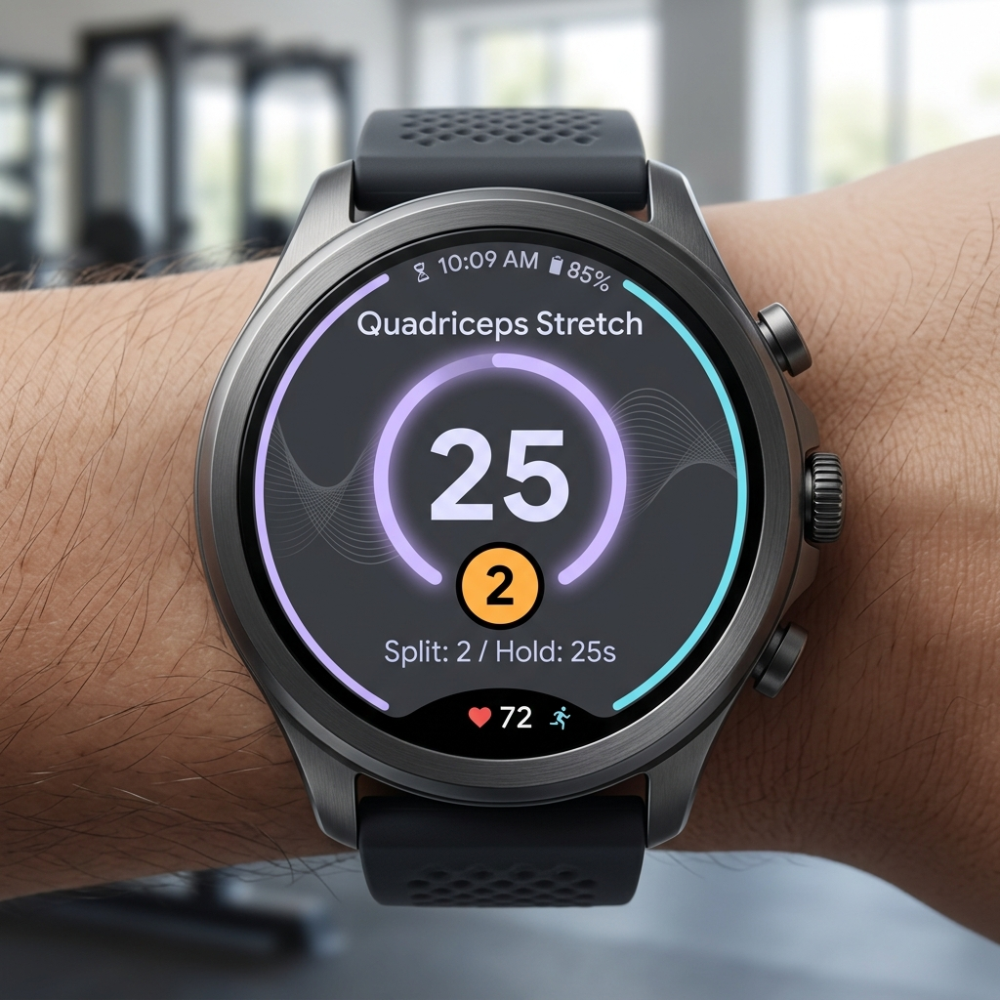

# Wear Stretch 🧘‍♂️⌚

**Wear Stretch** is a professional-grade stretching suite designed for Android and Wear OS. It allows users to build custom stretching routines on their phone, sync them instantly to their watch, and perform guided workouts with rich animations, haptic cues, and comprehensive health tracking.

---

## 📸 Screenshots & Mockups

### 📱 Mobile App (Phone)
| Routines List | "Apply All" Active | "Apply All" Redundant (Disabled) |
| :---: | :---: | :---: |
|  |  |  |
| **Manage routines list** | **Enable Apply All when values change** | **Black out Apply All if values match** |

### ⌚ Wear OS App (Watch)
| Routines Selection | Active Player & Split Indicator |
| :---: | :---: |
|  |  |
| **Routines list on watch** | **Guided timer showing remaining limbs** |

---

## 🌟 Key Features

### ⌚ Wear OS App (Watch)
*   **Guided Workout Player**: High-contrast workout screen showing active stretch timer, description, heart rate, and steps.
*   **Split Stretch Indicator**: For dual-sided exercises (e.g., left and right arm), a circular indicator shows remaining segments:
    *   🟡 **Amber circle (2)**: 2 exercises remaining to switch sides.
    *   🔴 **Rose circle (1)**: 1 exercise remaining before the next stretch.
*   **Vector Logo & Branding**: Hand-traced, simplified monochrome logo launcher icon and circular Wear splash screen icon for a premium look.
*   **Haptic Feedback**: Custom vibrations for transitions (500ms), "Switch Side" alerts (250ms), and workout completion (1s).
*   **Sensor Integration**: Continuous real-time heart rate monitoring and step counting logged directly via a foreground `health` service.
*   **Ongoing Activity support**: A "stretching" icon on the watch face allows one-tap quick-return back to the active timer.

### 📱 Mobile App (Phone)
*   **Routine Builder**: Build custom stretching sequences, change the order of stretches, and add/remove stretches from category folders.
*   **Material 3 "Apply All"**: Smart global transition time button. It dynamically lights up when values change, and blacks out (disabled) when all stretches are already updated to show that it is redundant.
*   **Delete Individual Workouts**: Full control over your history. Tap any session on the **Me** tab to view metrics and delete individual completed workouts from Health Connect.
*   **Health Connect Integration**: Syncs finished sessions to Health Connect for automatic tracking in **Fitbit**, **Google Health**, and other fitness suites.
*   **JSON Import & Export**: Export your entire library/routines list or import from JSON with intelligent conflict resolution (Add Only, Overwrite, or Full Sync).

---

## 🚀 Getting Started

### Prerequisites
*   **Phone**: Android 12 (API 31) or higher.
*   **Watch**: Wear OS 4 (API 33) or higher.
*   **Health Connect**: Ensure the Health Connect app is installed on your phone.

### Installation
1.  Clone the repository:
    ```bash
    git clone https://github.com/databoy2k/WearStretch.git
    ```
2.  Open the project in **Android Studio (Ladybug or newer)**.
3.  Deploy the `mobile` app to your phone and the `wear` app to your Wear OS watch.
4.  Allow Health Connect permissions on the mobile app's **Me** tab when prompted.
5.  Perform a sync using the **Reset Sync** button on the routines screen to load default preset stretches.

---

## 📖 How to Use

### 1. Customizing Stretches & Routines
*   Go to the **Library** tab to manage stretches, categories, durations, and whether they are **Split Stretches**.
*   In the **Routines** tab, tap **+** or edit an existing routine to add/reorder stretches, set a global transition time, and tap the checkmark to save and automatically sync/launch on the watch.

### 2. Deleting Completed Sessions
*   Go to the **Me** tab to view your recent stretching summary.
*   Under **Recent Sessions**, tap any session card to show the details dialog (average heart rate, maximum heart rate, steps, and location).
*   Tap the **Delete** button to remove the individual session from Health Connect.

---

## 🛠 Tech Stack
*   **Jetpack Compose & Wear Compose**: 100% Kotlin-based UI.
*   **Wearable Data Layer**: High-priority bidirectional syncing for routines, settings, and media.
*   **Health Connect Client**: Secure fitness data storage.
*   **Coil**: Optimized image and GIF decoder for workout previews.
*   **Gson**: JSON serialization and deserialization.

---

## 📄 License
This project is licensed under the MIT License - see the [LICENSE](LICENSE) file for details.
